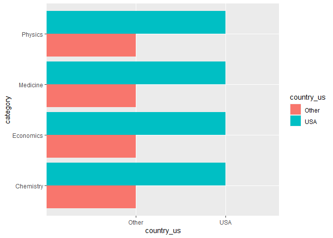
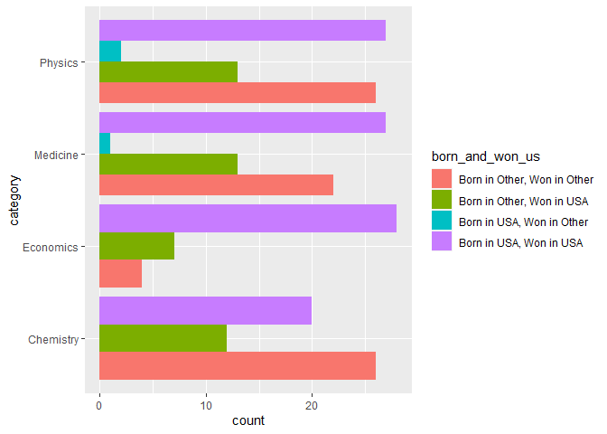

Lab 03 - Nobel laureates
================
Annie Somerville
02.10.21

### Load packages and data

``` r
library(tidyverse) 
```

``` r
nobel <- read_csv("data/nobel.csv")
```

## Exercises

### Exercise 1

``` r
glimpse(nobel)
```

    ## Rows: 935
    ## Columns: 26
    ## $ id                    <dbl> 1, 2, 3, 4, 5, 6, 6, 8, 9, 10, 11, 12, 13, 14...
    ## $ firstname             <chr> "Wilhelm Conrad", "Hendrik A.", "Pieter", "He...
    ## $ surname               <chr> "Röntgen", "Lorentz", "Zeeman", "Becquerel", ...
    ## $ year                  <dbl> 1901, 1902, 1902, 1903, 1903, 1903, 1911, 190...
    ## $ category              <chr> "Physics", "Physics", "Physics", "Physics", "...
    ## $ affiliation           <chr> "Munich University", "Leiden University", "Am...
    ## $ city                  <chr> "Munich", "Leiden", "Amsterdam", "Paris", "Pa...
    ## $ country               <chr> "Germany", "Netherlands", "Netherlands", "Fra...
    ## $ born_date             <date> 1845-03-27, 1853-07-18, 1865-05-25, 1852-12-...
    ## $ died_date             <date> 1923-02-10, 1928-02-04, 1943-10-09, 1908-08-...
    ## $ gender                <chr> "male", "male", "male", "male", "male", "fema...
    ## $ born_city             <chr> "Remscheid", "Arnhem", "Zonnemaire", "Paris",...
    ## $ born_country          <chr> "Germany", "Netherlands", "Netherlands", "Fra...
    ## $ born_country_code     <chr> "DE", "NL", "NL", "FR", "FR", "PL", "PL", "GB...
    ## $ died_city             <chr> "Munich", NA, "Amsterdam", NA, "Paris", "Sall...
    ## $ died_country          <chr> "Germany", "Netherlands", "Netherlands", "Fra...
    ## $ died_country_code     <chr> "DE", "NL", "NL", "FR", "FR", "FR", "FR", "GB...
    ## $ overall_motivation    <chr> NA, NA, NA, NA, NA, NA, NA, NA, NA, NA, NA, N...
    ## $ share                 <dbl> 1, 2, 2, 2, 4, 4, 1, 1, 1, 1, 1, 1, 2, 2, 1, ...
    ## $ motivation            <chr> "\"in recognition of the extraordinary servic...
    ## $ born_country_original <chr> "Prussia (now Germany)", "the Netherlands", "...
    ## $ born_city_original    <chr> "Lennep (now Remscheid)", "Arnhem", "Zonnemai...
    ## $ died_country_original <chr> "Germany", "the Netherlands", "the Netherland...
    ## $ died_city_original    <chr> "Munich", NA, "Amsterdam", NA, "Paris", "Sall...
    ## $ city_original         <chr> "Munich", "Leiden", "Amsterdam", "Paris", "Pa...
    ## $ country_original      <chr> "Germany", "the Netherlands", "the Netherland...

This data has 935 observations/nobel laureates and 26 variables.

### Exercise 2

#### r nobel\_living

``` r
nobel_living <- nobel %>%
  filter (
    is.na(died_date) &
    !is.na(country_original) &
    gender != "org"
  )
glimpse(nobel_living)
```

    ## Rows: 228
    ## Columns: 26
    ## $ id                    <dbl> 68, 69, 95, 97, 98, 99, 101, 103, 106, 107, 1...
    ## $ firstname             <chr> "Chen Ning", "Tsung-Dao", "Leon N.", "Leo", "...
    ## $ surname               <chr> "Yang", "Lee", "Cooper", "Esaki", "Giaever", ...
    ## $ year                  <dbl> 1957, 1957, 1972, 1973, 1973, 1973, 1974, 197...
    ## $ category              <chr> "Physics", "Physics", "Physics", "Physics", "...
    ## $ affiliation           <chr> "Institute for Advanced Study", "Columbia Uni...
    ## $ city                  <chr> "Princeton NJ", "New York NY", "Providence RI...
    ## $ country               <chr> "USA", "USA", "USA", "USA", "USA", "United Ki...
    ## $ born_date             <date> 1922-09-22, 1926-11-24, 1930-02-28, 1925-03-...
    ## $ died_date             <date> NA, NA, NA, NA, NA, NA, NA, NA, NA, NA, NA, ...
    ## $ gender                <chr> "male", "male", "male", "male", "male", "male...
    ## $ born_city             <chr> "Hofei Anhwei", "Shanghai", "New York NY", "O...
    ## $ born_country          <chr> "China", "China", "USA", "Japan", "Norway", "...
    ## $ born_country_code     <chr> "CN", "CN", "US", "JP", "NO", "GB", "GB", "US...
    ## $ died_city             <chr> NA, NA, NA, NA, NA, NA, NA, NA, NA, NA, NA, N...
    ## $ died_country          <chr> NA, NA, NA, NA, NA, NA, NA, NA, NA, NA, NA, N...
    ## $ died_country_code     <chr> NA, NA, NA, NA, NA, NA, NA, NA, NA, NA, NA, N...
    ## $ overall_motivation    <chr> NA, NA, NA, NA, NA, NA, NA, NA, NA, NA, NA, N...
    ## $ share                 <dbl> 2, 2, 3, 4, 4, 2, 2, 3, 2, 3, 4, 4, 3, 3, 2, ...
    ## $ motivation            <chr> "\"for their penetrating investigation of the...
    ## $ born_country_original <chr> "China", "China", "USA", "Japan", "Norway", "...
    ## $ born_city_original    <chr> "Hofei Anhwei", "Shanghai", "New York NY", "O...
    ## $ died_country_original <chr> NA, NA, NA, NA, NA, NA, NA, NA, NA, NA, NA, N...
    ## $ died_city_original    <chr> NA, NA, NA, NA, NA, NA, NA, NA, NA, NA, NA, N...
    ## $ city_original         <chr> "Princeton NJ", "New York NY", "Providence RI...
    ## $ country_original      <chr> "USA", "USA", "USA", "USA", "USA", "United Ki...

I used the code above to filter for people opposed to organizations,
those who are still living, and those who had available countries.

### Exercise 3

``` r
nobel_living <- nobel_living %>%
  mutate(
    country_us = if_else(country == "USA", "USA", "Other")
  )
```

``` r
nobel_living_science <- nobel_living %>%
  filter(category %in% c("Physics", "Medicine", "Chemistry", "Economics"))
```

``` r
ggplot(data=nobel_living_science, aes(x=category, fill=country_us)) +
geom_bar(stat="count", position=position_dodge()) +
  coord_flip()
```

<!-- -->

Winners of science prizes were much more likely to be in the US than
other countries, so I would say that Buzzfeed’s article headline seems
accurate.

### Exercise 4

``` r
nobel_living_science <- nobel_living_science %>%
  mutate(
    born_country_us = if_else(born_country == "USA", "USA", "Other")
  )

nobel_living_science %>%
  count(born_country_us)
```

    ## # A tibble: 2 x 2
    ##   born_country_us     n
    ## * <chr>           <int>
    ## 1 Other             123
    ## 2 USA               105

636 of the winners were not born in the US, and 271 winners were born in
the US. Out of the science winners, 123 were born outside the US and 105
were born in the US.

### Exercise 5

``` r
nobel_living_science <- nobel_living_science %>%  
  mutate(
    born_and_won_us = case_when(born_country_us == "Other" & country_us == "Other" ~ "Born in Other, Won in Other", #condition 1
                         born_country_us == "Other" & country_us == "USA" ~ "Born in Other, Won in USA", #condition 2
                         born_country_us == "USA" & country_us == "Other" ~ "Born in USA, Won in Other", #condition 3
                         born_country_us == "USA" & country_us == "USA" ~ "Born in USA, Won in USA")) #condition4

nobel_living_science %>%
  count(born_and_won_us)
```

    ## # A tibble: 4 x 2
    ##   born_and_won_us                 n
    ## * <chr>                       <int>
    ## 1 Born in Other, Won in Other    78
    ## 2 Born in Other, Won in USA      45
    ## 3 Born in USA, Won in Other       3
    ## 4 Born in USA, Won in USA       102

``` r
ggplot(data=nobel_living_science, aes(x=category, group=born_and_won_us, fill=born_and_won_us)) +
geom_bar(stat="count", position="dodge") +
  coord_flip()
```

<!-- --> Buzzfeed’s claim
definitely seems accurate based on this visualization because there are
many people born in other countries who immigrated to the USA and won
the nobel prize, thus contributing to American science.

### Exercise 6

``` r
nobel_living_science %>% 
  filter(born_and_won_us=="Born in Other, Won in USA") %>%
  count(born_country, sort=TRUE)
```

    ## # A tibble: 21 x 2
    ##    born_country       n
    ##    <chr>          <int>
    ##  1 Germany            7
    ##  2 United Kingdom     7
    ##  3 China              5
    ##  4 Canada             4
    ##  5 Japan              3
    ##  6 Australia          2
    ##  7 Israel             2
    ##  8 Norway             2
    ##  9 Austria            1
    ## 10 Finland            1
    ## # ... with 11 more rows

Both Germany and the UK are the most common countries to have laureates
who were born in those countries, but won the prize in the US.
